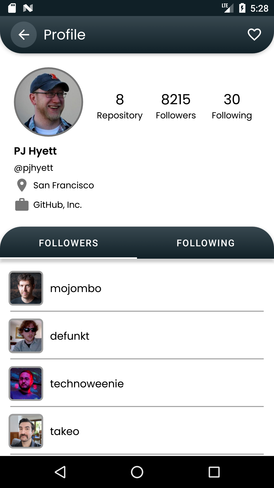
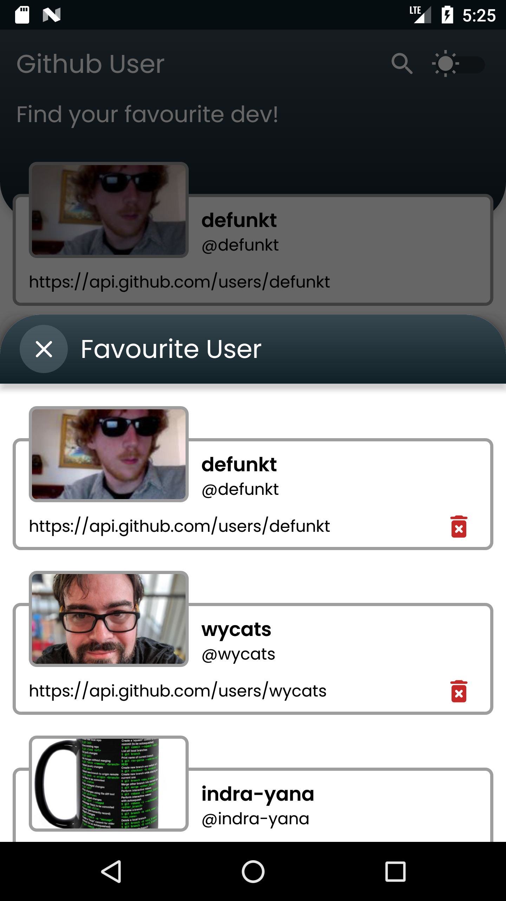
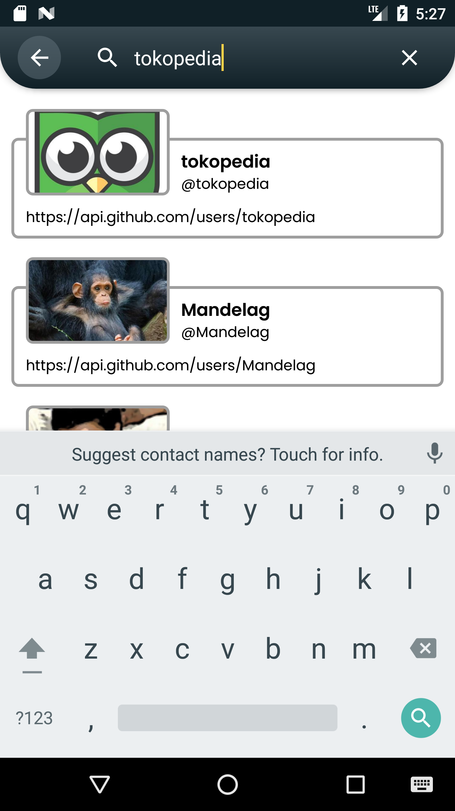

## Github-User
Github user app - dicoding submission BFAA

**Status**: Maintained :hammer_and_wrench:

### Features
- Kotlin
- MVVM Design Pattern
- Local and Remote Data Source
- Android Architecture Component
- Github User API ([GitHub REST API](https://docs.github.com/en/rest))
- etc

### Dependency
- Retrofit
- ViewModel
- LiveData
- Coroutines
- Material Design
- Jetpack Component
- Room
- Datastore Preferences
- ViewBinding
- Shimmer
- etc

### Show Case

    
    
    
    
    
    

### Credits
Feel free to clone this project for your references.
I really appreciate if you give a star for this repo or following my account. cheers! :clinking_glasses:

Copyright ©2021 Indra Muliana (indra.ndra26@gmail.com)

Build With :coffee: